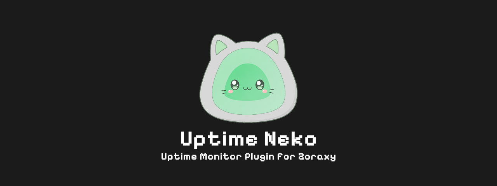
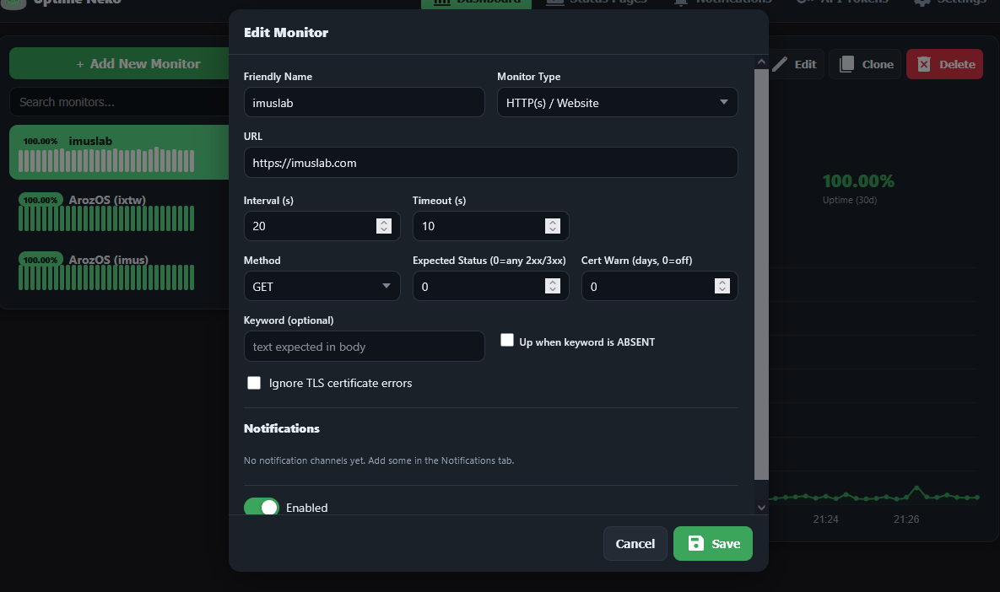
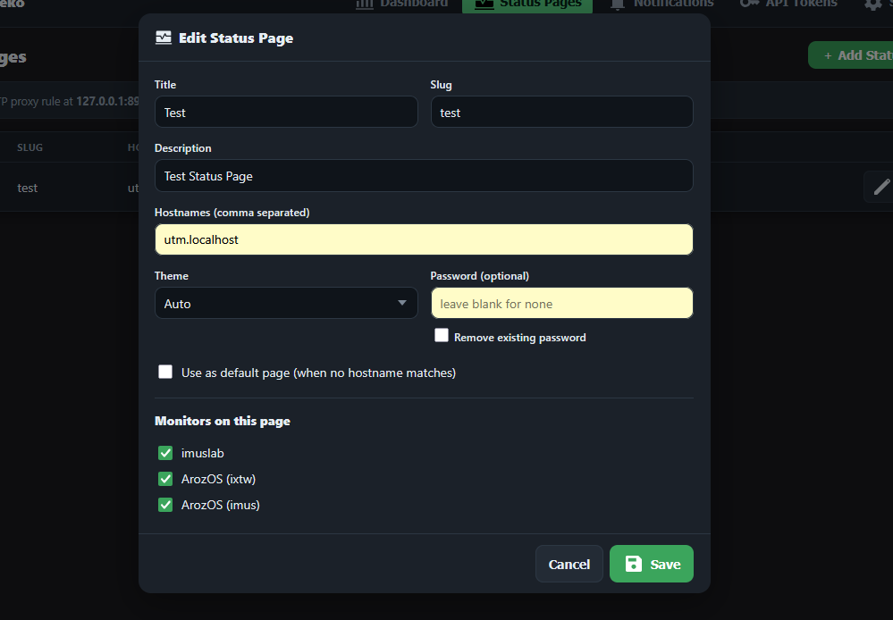
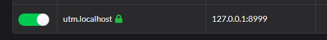
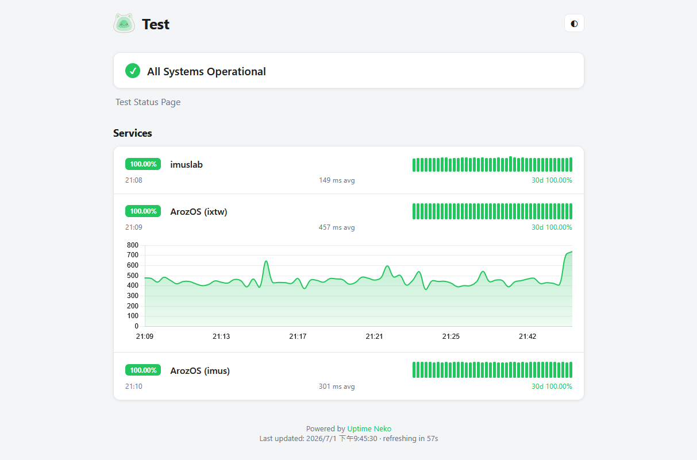
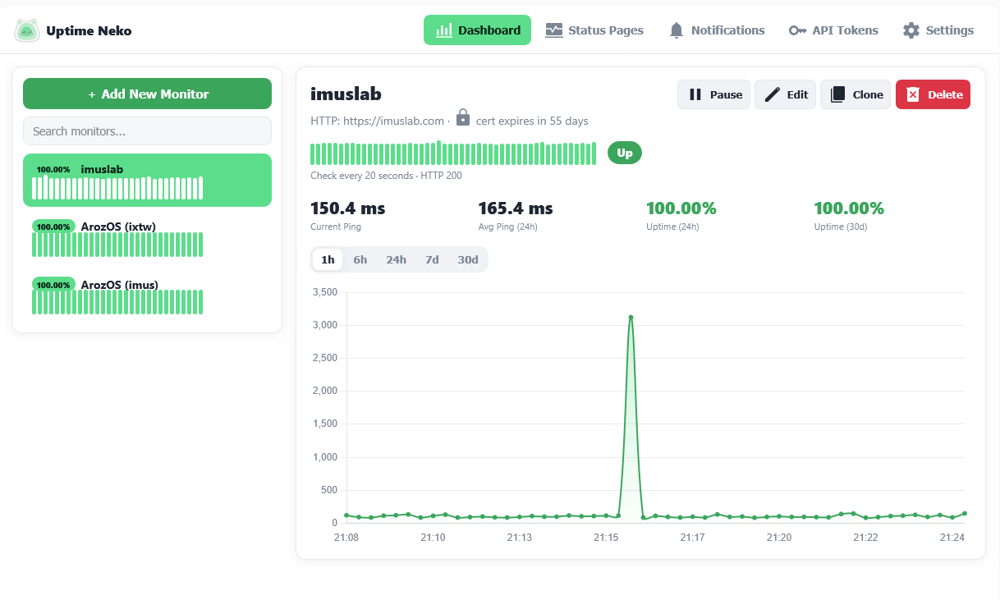
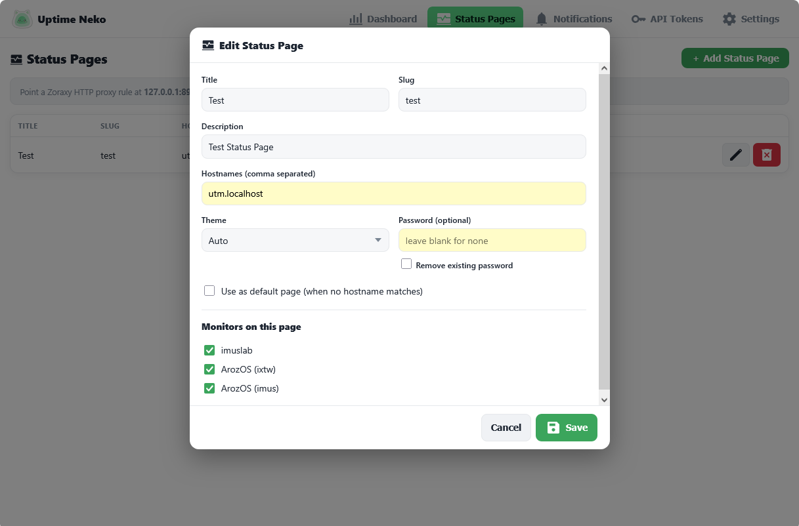
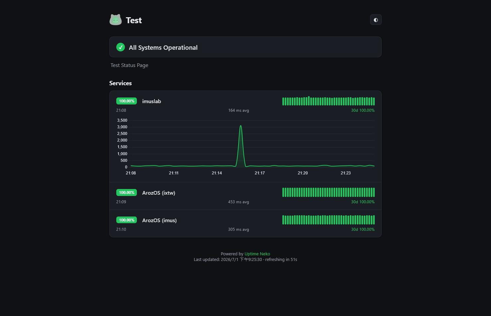
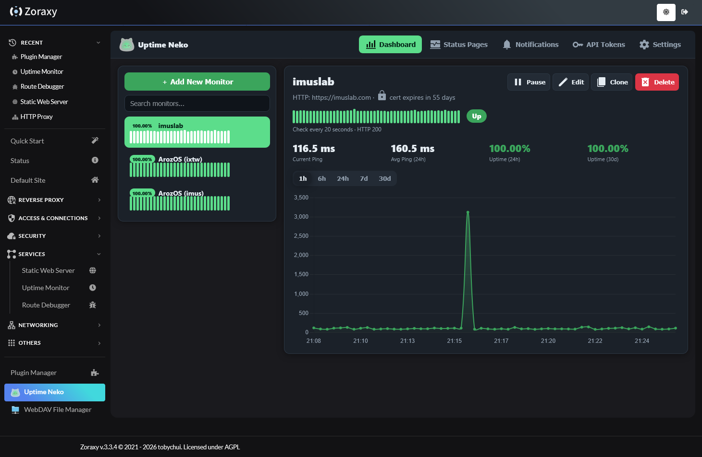
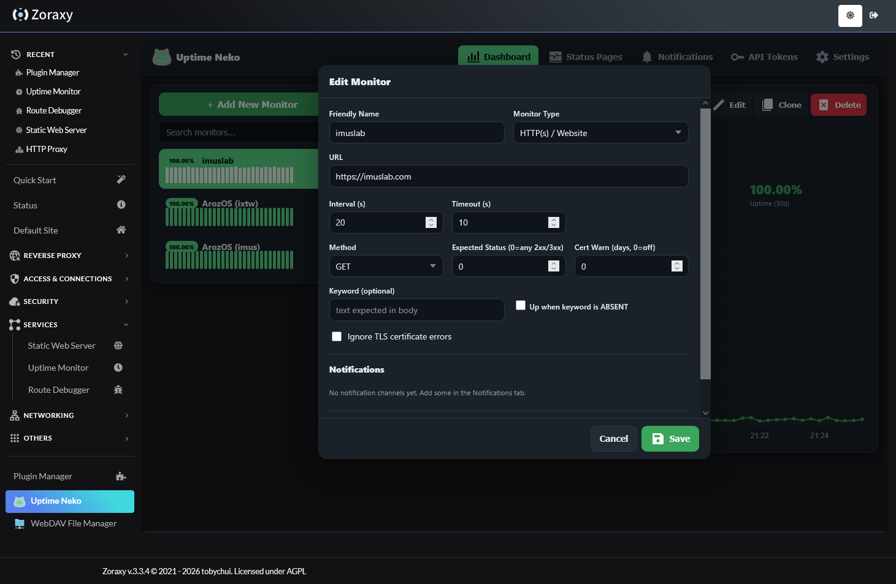

# Uptime Neko

A lightweight uptime monitoring plugin for Zoraxy.

Uptime Neko runs alongside your Zoraxy node and continuously monitors services both inside and outside your homelab. Unlike Zoraxy's built-in uptime monitor, which only checks locally hosted reverse proxy targets, Uptime Neko can monitor virtually any public or private endpoint.

## Features

- Multiple monitoring methods
  - HTTP / HTTPS
  - ICMP Ping
  - TCP Port *(Experimental)*
  - DNS Records *(Experimental)*
  - SSL Certificate Expiry *(Experimental)*
- High-performance concurrent monitoring powered by Go goroutines
- Configurable HTTP request method, expected status codes, and SSL expiry warnings
- Webhook notification support
- Public status pages
  - Share uptime statistics with visitors
  - Optional password protection
  - Multiple status pages for different domains or services
- Zero external dependencies
  - No Docker, Node.js, or additional runtime required

## Install

### Install from the Zoraxy Plugin Store

Open the **Plugin Store** inside Zoraxy, search for **Uptime Neko**, and click **Install**.

Once installed, the plugin will appear in the **Plugin List** automatically.

### Build & Install from Source

Building from source is recommended for air-gapped or offline deployments.

#### Requirements

- Go compiler
- Cmake 

Clone the repository and build all supported targets:

```
git clone https://github.com/aroz-online/uptime-neko
cd uptime-neko
make all
```

Compiled binaries will be placed in the `build/` directory.

Copy the binary that matches your platform into the Zoraxy plugin directory. The plugin folder **must** be named exactly.

```text
{zoraxy_root}/plugins/uptime-neko/
```

For example:

```
{zoraxy_root_folder}/plugins/uptime-neko/uptime-neko_linux_amd64
```

Optionally, copy the plugin icon so it appears correctly inside the Zoraxy web interface:

```
cp ./icon.png {zoraxy_root_folder}/plugins/uptime-neko/icon.png
```


## Usage

To enable Uptime monitor on your domain, follow the steps below

1. Create a few monitor targets. Here is a quick example
   
2. Create a status page, in the "Monitors on this page", select the monitor targets that you just created. You should replace the Hostname to your preferred subdomain hostname, for example `uptime.mydomain.com` or in this example, `utm.localhost`
   
3. Add the Uptime Neko public endpoint as a new HTTP proxy rule and point the correct hostname to it, in the example above, it is `utm.localhost -> 127.0.0.1:8999`. 
    

4. Visit `utm.localhost` (or the hostname you assigned for showing the uptime monitor public page), you shd be able to see the uptime status in Read Only mode.
   

   

## Screenshots






The public page, which shows a READ ONLY interface for uptime status




Here are some screenshot after installing into Zoraxy as plugin






## Reference

We take some inspiration from the wonderful [Uptime Kuma](https://uptime.kuma.pet/) Project ❤️

## License

AGPL
